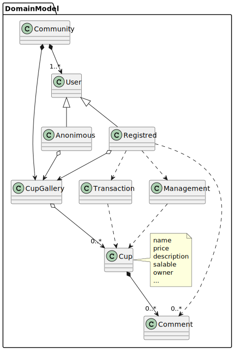

# Fanaticups.org

SPA web application for anonimous and registred users. It will serve to bring together lovers of cups and mugs. They can be viewed, upload, modify, delete, bought, sold, and exchange opinions through a chat.

Technological stack:
- **Frontend:** Angular
- **Backend:** Spring-boot
- **Auth and Storage server:** Google Firebase
- **BD:** MySql
- **Deploy:** Google Cloud

We will use the Rational Unified Process (RUP) development method to diagramming the different activities.

### Domain model

